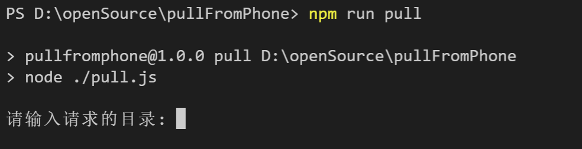

# 将bilibili视频缓存文件从手机上复制到电脑上

> 前提电脑上安装有 [adb](https://blog.csdn.net/x2584179909/article/details/108319973) [nodejs](https://nodejs.org/zh-cn/download/)
## 首先将手机连接电脑
```
adb devices

adb tcpip 8888

adb connect 192.168.*.*:8888

adb devices
```

## 下载项目

### 运行
```
npm install

npm run pull

```
在手机段打开/sdcard/Android/data/tv.danmaku.bili/download/文件夹

### 输入目录



## 开始复制


## [将bilibili安卓客户端的离线缓存转换为mp4在这里](https://github.com/bitdust/bili2mp4)
